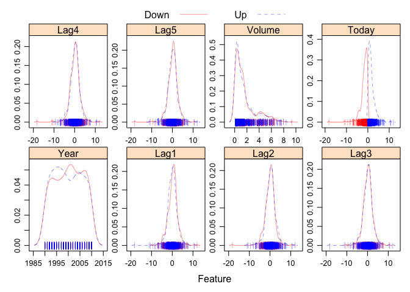
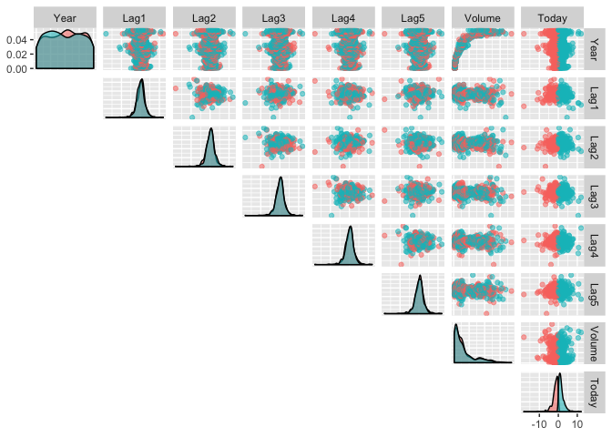
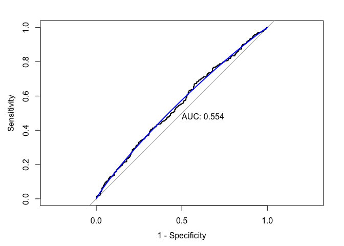
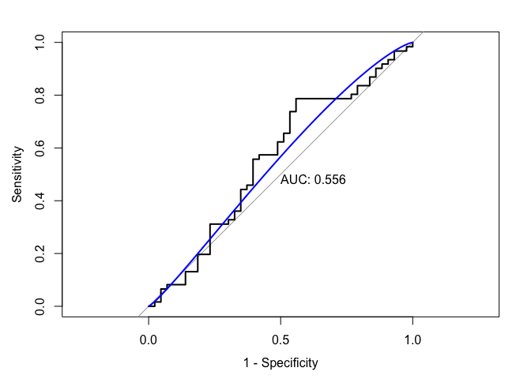
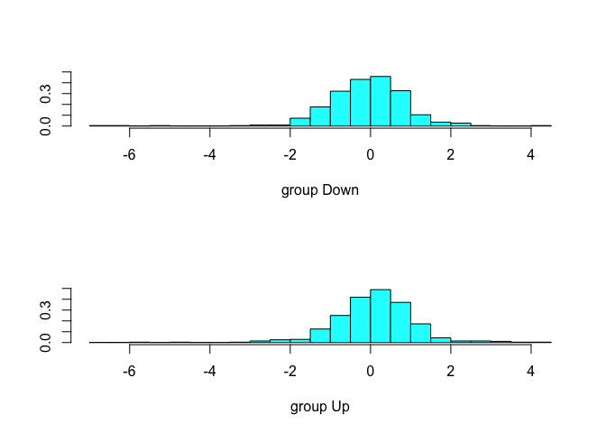
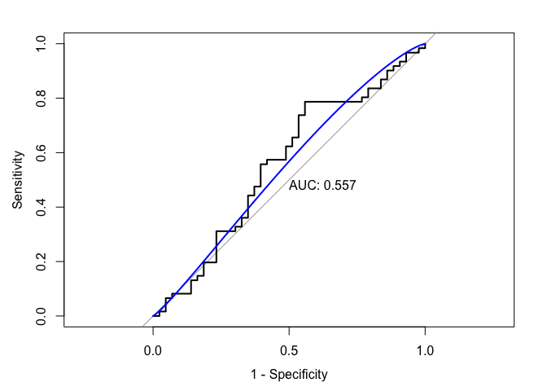
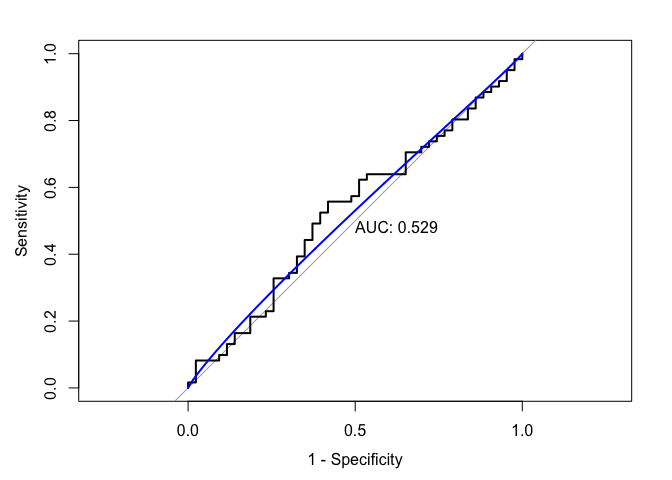
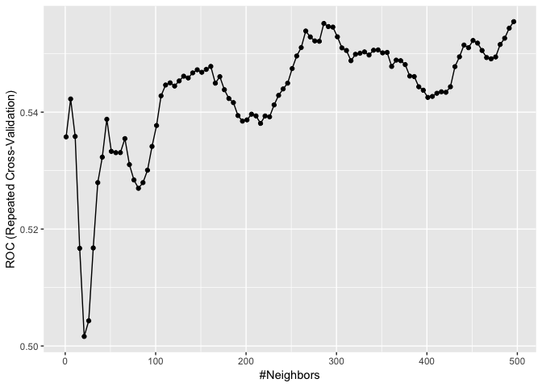
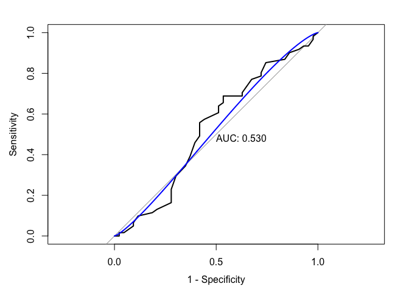

HW3
================
JunLu
4/5/2019

Import the data
---------------

``` r
library(ISLR)
data("Weekly")
```

(a)
---

Produce some graphical summaries of the Weekly data.

### Desctiptive statistics

``` r
dim(Weekly)
```

    ## [1] 1089    9

``` r
summary(Weekly)
```

    ##       Year           Lag1               Lag2               Lag3         
    ##  Min.   :1990   Min.   :-18.1950   Min.   :-18.1950   Min.   :-18.1950  
    ##  1st Qu.:1995   1st Qu.: -1.1540   1st Qu.: -1.1540   1st Qu.: -1.1580  
    ##  Median :2000   Median :  0.2410   Median :  0.2410   Median :  0.2410  
    ##  Mean   :2000   Mean   :  0.1506   Mean   :  0.1511   Mean   :  0.1472  
    ##  3rd Qu.:2005   3rd Qu.:  1.4050   3rd Qu.:  1.4090   3rd Qu.:  1.4090  
    ##  Max.   :2010   Max.   : 12.0260   Max.   : 12.0260   Max.   : 12.0260  
    ##       Lag4               Lag5              Volume       
    ##  Min.   :-18.1950   Min.   :-18.1950   Min.   :0.08747  
    ##  1st Qu.: -1.1580   1st Qu.: -1.1660   1st Qu.:0.33202  
    ##  Median :  0.2380   Median :  0.2340   Median :1.00268  
    ##  Mean   :  0.1458   Mean   :  0.1399   Mean   :1.57462  
    ##  3rd Qu.:  1.4090   3rd Qu.:  1.4050   3rd Qu.:2.05373  
    ##  Max.   : 12.0260   Max.   : 12.0260   Max.   :9.32821  
    ##      Today          Direction 
    ##  Min.   :-18.1950   Down:484  
    ##  1st Qu.: -1.1540   Up  :605  
    ##  Median :  0.2410             
    ##  Mean   :  0.1499             
    ##  3rd Qu.:  1.4050             
    ##  Max.   : 12.0260

There are 1089 observations and 9 variables in this dataset.

### Distribution of continuous variables

``` r
transparentTheme(trans = .4)
featurePlot(x = Weekly[, 1:8],
            y = Weekly$Direction,
            scales = list(x = list(relation = "free"), y = list(relation = "free")),
            plot = "density", pch = "|",auto.key = list(columns = 2))
```

 After visualizing the distributions of each continuous variable by direction, we can't see some different patterns of distributions between different directions in the five Lag variables and Volume.

### Pair plots

``` r
ggpairs(Weekly, 
        columns = 1:8,
        upper = list(continuous = "points"),
        lower = "blank",
        aes(colour = Direction, alpha = 0.5)
        )
```

 Even in pair plots, we can't separate different direction by just combining five Lag variables and Volume.

### (b)

Use the full data set to perform a logistic regression with Directionas the response and the five Lag variables plus Volume as predictors. Do any of the predictors appear to be statistically significant? If so, which ones?

``` r
glm.fit = glm(Direction~.,data = Weekly[c(-1, -8)],family = binomial)
summary(glm.fit)
```

    ## 
    ## Call:
    ## glm(formula = Direction ~ ., family = binomial, data = Weekly[c(-1, 
    ##     -8)])
    ## 
    ## Deviance Residuals: 
    ##     Min       1Q   Median       3Q      Max  
    ## -1.6949  -1.2565   0.9913   1.0849   1.4579  
    ## 
    ## Coefficients:
    ##             Estimate Std. Error z value Pr(>|z|)   
    ## (Intercept)  0.26686    0.08593   3.106   0.0019 **
    ## Lag1        -0.04127    0.02641  -1.563   0.1181   
    ## Lag2         0.05844    0.02686   2.175   0.0296 * 
    ## Lag3        -0.01606    0.02666  -0.602   0.5469   
    ## Lag4        -0.02779    0.02646  -1.050   0.2937   
    ## Lag5        -0.01447    0.02638  -0.549   0.5833   
    ## Volume      -0.02274    0.03690  -0.616   0.5377   
    ## ---
    ## Signif. codes:  0 '***' 0.001 '**' 0.01 '*' 0.05 '.' 0.1 ' ' 1
    ## 
    ## (Dispersion parameter for binomial family taken to be 1)
    ## 
    ##     Null deviance: 1496.2  on 1088  degrees of freedom
    ## Residual deviance: 1486.4  on 1082  degrees of freedom
    ## AIC: 1500.4
    ## 
    ## Number of Fisher Scoring iterations: 4

``` r
contrasts(Weekly$Direction)
```

    ##      Up
    ## Down  0
    ## Up    1

Lag2 variable appear to be statistically significant (Pr = 0.0296 &lt; 0.05).

### (c)

Compute the confusion matrix and overall fraction of correct predictions. Briefly explain what the confusion matrix is telling you.

We use Bayes classifier (cutoff 0.5).

``` r
glm_pred_prob = predict(glm.fit, type = "response")
glm_pred = rep("Down", length(glm_pred_prob))
glm_pred[glm_pred_prob > 0.5] = "Up"
```

#### Overall fraction of correct predictions.

``` r
sum(glm_pred == Weekly$Direction)/length(glm_pred_prob)
```

    ## [1] 0.5610652

Overall fraction of correct predictions is 56.11%.

#### The confusion matrix

``` r
confusionMatrix(data = as.factor(glm_pred),
                reference = Weekly$Direction,
                positive = "Up")
```

    ## Confusion Matrix and Statistics
    ## 
    ##           Reference
    ## Prediction Down  Up
    ##       Down   54  48
    ##       Up    430 557
    ##                                          
    ##                Accuracy : 0.5611         
    ##                  95% CI : (0.531, 0.5908)
    ##     No Information Rate : 0.5556         
    ##     P-Value [Acc > NIR] : 0.369          
    ##                                          
    ##                   Kappa : 0.035          
    ##                                          
    ##  Mcnemar's Test P-Value : <2e-16         
    ##                                          
    ##             Sensitivity : 0.9207         
    ##             Specificity : 0.1116         
    ##          Pos Pred Value : 0.5643         
    ##          Neg Pred Value : 0.5294         
    ##              Prevalence : 0.5556         
    ##          Detection Rate : 0.5115         
    ##    Detection Prevalence : 0.9063         
    ##       Balanced Accuracy : 0.5161         
    ##                                          
    ##        'Positive' Class : Up             
    ## 

The positive we defined is "Up". The negative is "down".

-   The accuracy (overall fraction of correct predictions) is 0.5611.
-   The kappa (the agreement between the preditive value and the true value) is 0.035, which is small.
-   The sensitivity (the proportion of actual "Up" that are correctly identified) is 92.07%
-   The specificity (the proportion of actual "Down" that are correctly identified) is 11.16%. This model does not have a good performance in identifying "Down".
-   The PPV is 56.43% and NPV is 53.94%.
-   And there are other statistics in the confusion matrix.

### (d)

Plot the ROC curve using the predicted probability from logistic regression and report the AUC.

``` r
roc_glm = roc(as.factor(Weekly$Direction), glm_pred_prob)
plot(roc_glm, legacy.axes = TRUE, print.auc = TRUE)
plot(smooth(roc_glm), col = 4, add = TRUE)
```

 The AUC is 0.554 which is close to 0.5, thus our model may not be a good classifier.

### (e)

Now fit the logistic regression model using a training data period from 1990 to 2008, with Lag1 and Lag2 as the predictors. Plot the ROC curve using the held out data (that is, the data from 2009 and 2010) and report the AUC.

``` r
train = Weekly %>% 
    filter(Year < 2009) %>% 
    dplyr::select(Lag1, Lag2, Direction)

test = Weekly %>% 
    filter(Year >= 2009) %>% 
    dplyr::select(Lag1, Lag2, Direction)
```

#### Fit the logistic model

``` r
glm.fit2 = glm(Direction ~ ., data = train,family = binomial)
summary(glm.fit2)
```

    ## 
    ## Call:
    ## glm(formula = Direction ~ ., family = binomial, data = train)
    ## 
    ## Deviance Residuals: 
    ##     Min       1Q   Median       3Q      Max  
    ## -1.6149  -1.2565   0.9989   1.0875   1.5330  
    ## 
    ## Coefficients:
    ##             Estimate Std. Error z value Pr(>|z|)   
    ## (Intercept)  0.21109    0.06456   3.269  0.00108 **
    ## Lag1        -0.05421    0.02886  -1.878  0.06034 . 
    ## Lag2         0.05384    0.02905   1.854  0.06379 . 
    ## ---
    ## Signif. codes:  0 '***' 0.001 '**' 0.01 '*' 0.05 '.' 0.1 ' ' 1
    ## 
    ## (Dispersion parameter for binomial family taken to be 1)
    ## 
    ##     Null deviance: 1354.7  on 984  degrees of freedom
    ## Residual deviance: 1347.0  on 982  degrees of freedom
    ## AIC: 1353
    ## 
    ## Number of Fisher Scoring iterations: 4

``` r
contrasts(train$Direction)
```

    ##      Up
    ## Down  0
    ## Up    1

#### Plot the ROC using test data

``` r
glm_pred_prob2 = predict(glm.fit2, type = "response", newdata = test)
roc_glm2 <- roc(test$Direction, glm_pred_prob2)
plot(roc_glm2, legacy.axes = TRUE, print.auc = TRUE)
plot(smooth(roc_glm2), col = 4, add = TRUE)
```

 The AUC is 0.556

### (f)

Repeat (e) using LDA and QDA.

#### LDA

##### Fit the LDA model

``` r
lda_fit = lda(Direction ~ ., data = train) 
plot(lda_fit)
```



##### Plot the ROC using test data

``` r
lda_pred = predict(lda_fit, newdata = test) 
head(lda_pred$posterior)
```

    ##        Down        Up
    ## 1 0.5602039 0.4397961
    ## 2 0.3079163 0.6920837
    ## 3 0.4458032 0.5541968
    ## 4 0.4785107 0.5214893
    ## 5 0.4657943 0.5342057
    ## 6 0.5262907 0.4737093

``` r
roc_lda = roc(test$Direction, lda_pred$posterior[,2], levels = c("Down", "Up"))
plot(roc_lda, legacy.axes = TRUE, print.auc = TRUE) 
plot(smooth(roc_lda), col = 4, add = TRUE)
```

 The AUC is 0.557

#### QDA

##### Fit the QDA model

``` r
qda_fit = qda(Direction ~ ., data = train) 
qda_pred = predict(qda_fit, newdata = test) 
```

##### Plot the ROC using test data

``` r
qda_pred = predict(qda_fit, newdata = test) 
roc_qda = roc(test$Direction, qda_pred$posterior[,2], levels = c("Down", "Up"))
plot(roc_qda, legacy.axes = TRUE, print.auc = TRUE) 
plot(smooth(roc_qda), col = 4, add = TRUE)
```

 The AUC is 0.529

### (g)

Repeat (e) using KNN. Briefly discuss your results.

``` r
set.seed(1)
ctrl = trainControl(method = "repeatedcv",
                    repeats = 5,
                    summaryFunction = twoClassSummary,
                    classProbs = TRUE)

knn_fit = train(Direction ~ ., data = train,
                method = "knn",
                trControl = ctrl,
                preProcess = c("center","scale"), 
                metric = "ROC",
                tuneGrid = data.frame(k = seq(1, 500, by = 5)))

ggplot(knn_fit)
```



``` r
knn_fit$bestTune
```

    ##       k
    ## 100 496

The best tune is k = 496. We can't see a clear upward and then a downward trend in the range we try. But when the K is greater 500, the model fitting process can be problematic. Thus we only try 1 to 500.

``` r
knn_predict =  predict.train(knn_fit, newdata = test , type = "prob")
knn_roc = roc(test$Direction, knn_predict[,"Up"], levels = c("Down", "Up"))
plot(knn_roc, legacy.axes = TRUE, print.auc = TRUE)
plot(smooth(knn_roc), col = 4, add = TRUE)
```



The AUC is 0.530.

Conclusion
----------

``` r
table = tibble(
    metric = 'AUC', 
    logistic = 0.556, 
    lda = 0.557,
    qda = 0.529,
    knn = 0.530
    )

table %>% knitr::kable(digits = 3)
```

| metric |  logistic|    lda|    qda|   knn|
|:-------|---------:|------:|------:|-----:|
| AUC    |     0.556|  0.557|  0.529|  0.53|

By comparing AUC using test data, we can see that no one model predicts the data direction (all are near 0.5), but LDA has a relatively higher performance on this test data by using AUC as a metric.

(We don't choose model by test data. Just in order to answer this homework questions, we use test data)
